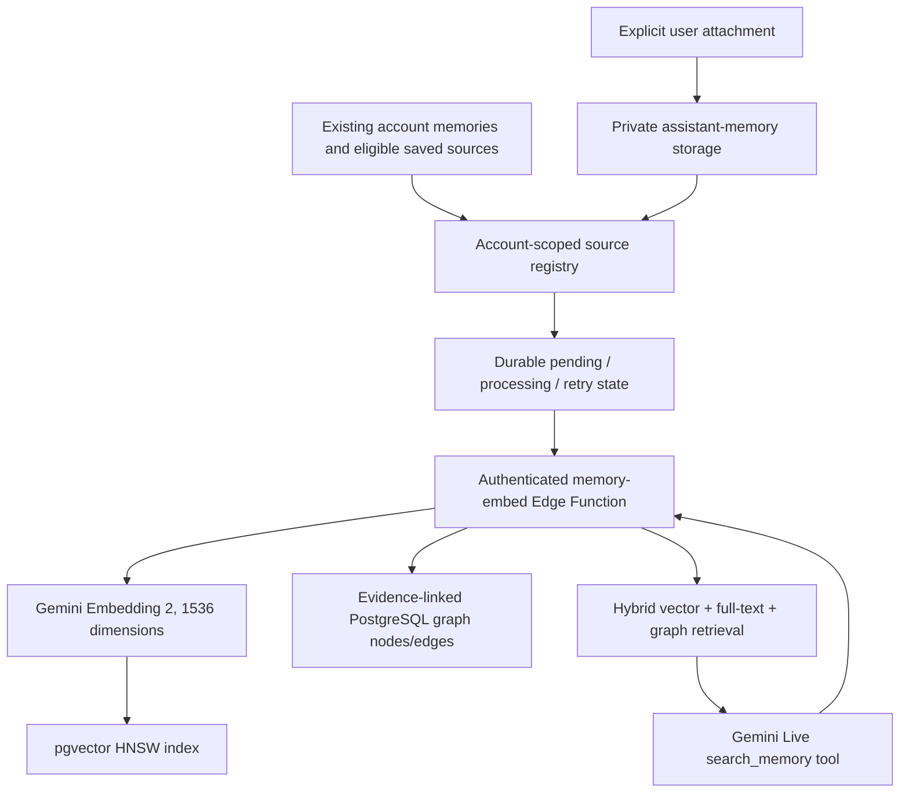

# PR16: Multimodal Personal Memory (1536 dimensions)

## Architecture

## Confirmed API

- Model: `gemini-embedding-2`, **not** `gemini-embedding-002`.
- REST: `POST /v1beta/models/gemini-embedding-2:embedContent`
- `output_dimensionality: 1536`, `extensions.vector(1536)`, HNSW cosine index.
- Text retrieval: documents use `title: none | text: ...`, queries use `task: search result | query: ...`.
- Supported native media: PNG/JPEG, MP3/WAV, MP4/MOV, PDF, subject to the provider's duration/page/token limits.
- No `taskType` request argument. Model spaces are versioned; other embedding models are not comparable.

References: https://ai.google.dev/gemini-api/docs/embeddings

## What this branch implements

- Additive source registry, private memory-asset metadata, account-scoped pgvector embeddings, graph nodes/edges, and auth-checked SQL procedures.
- Existing `assistant_memories` lifecycle preserved. Active rows are queued; superseded/forgotten rows leave the search index. Pending writes are revision/fingerprint-fenced.
- Consent-enabled Note attachments can also be embedded without copying their original objects. Source changes and deletions invalidate stale vectors and graph edges.
- One explicit attachment per uploaded file, with additional files allowed for the same memory. The original file remains the canonical private Storage object, not duplicated in the graph.
- Authenticated Edge Function reads only eligible sources, validates provider dimension count, and commits vectors. Missing credentials and provider failure do not mutate the original memory.
- Keyword plus semantic ranking; related graph source IDs returned as evidence. Conservative related-to connections use similarity, never infer factual support from similarity.
- Optional Gemini extraction of explicitly saved memory entities. The database checks each proposed label against an exact quote from its source.
- Gemini Live `search_memory` function declaration and account-scoped client integration. Search failures return tool errors instead of fabricated memory.
- Remembered UI: manual indexing of up to three queued sources; explicit file attachment; account opt-in to other saved sources, Notes, and synced Dictations.
- Existing device-to-Gemini live audio and transcription are unchanged.

## Deliberate safety boundaries

- Indexing is NOT a background microphone, camera, screen, clipboard, or computer-activity monitor.
- Notes and dictations require explicit source permission; cloud dictation history remains independently opt-in. Conversation source indexing additionally requires semantic search opt-in.
- No implicit production migration/deployment, no unbounded historical backfill, and no scheduled paid model calls are performed by this PR.
- Only authenticated account holders can claim/complete jobs. Claim attempts and leases are bounded. Responses filter candidates by current permissions, including after source revocation.
- Retrieved passages are treated as source evidence, not executable instructions.
- Text summaries in the source registry are bounded search caches. Canonical content remains in its original table.

## Deployment (NOT EXECUTED)

1. Review and run `supabase/migrations/20261008090000_multimodal_memory.sql`.
2. Review and run `supabase/migrations/20261008091000_memory_graph_enrichment.sql`.
3. Review and run `supabase/migrations/20261008092000_memory_source_lifecycle.sql`.
4. Review and run `supabase/migrations/20261008093000_memory_graph_viewer.sql` for the new graph page.
5. Deploy `supabase/functions/memory-embed` using the project's authenticated Edge Function pattern. Set `GEMINI_API_KEY` in server secrets; never put it in Vite/client config. Follow the same JWT gateway policy as `memory-learn`.
6. Open Remembered on a test account and click **Index next three memories**. Verify vectors have exactly 1536 dimensions, the server returns evidence, and cross-user queries fail.
7. Opt into Notes or synced Dictations only from that same test account. Confirm no old local-only recordings or screenshot pixels are copied.
8. Verify save/correct/forget on Android and Windows. Run additional bounded indexing only after explicit approval.
9. Do not merge/release until CI, schema tests, privacy tests, and real-device checks are complete.

## New interactive Memory Graph page

The sidebar now includes a **Memory Graph** top-level destination, available in the shared Windows and Android shell. It renders an interactive, read-only SVG network without a new npm package:

- Each active Assistant memory appears, even if its embedding is still pending.
- Indexed memories, Notes, Assistant messages, eligible Dictations and file attachments appear as source-type nodes.
- Person, project, goal, decision, and other known entity nodes appear only when linked to a currently authorized source.
- Relationships are **actual** rows from `memory_graph_edges`. The interface does not invent links or build a graph from similar-looking text.
- Click or tap a node to inspect its saved memory preview, state, real source table, record ID, date, and connected nodes.
- Pan/drag/zoom/reset, search, filter by source type, connected-only mode, and category legend are available.
- The page polls a read-only database snapshot every 15 seconds while mounted and visible (optional auto-refresh). It never invokes paid embeddings or creates memories on page load.
- On small screens the details inspector stacks below the graph canvas.
- A bounded database sample limits payload size. Extend with server-side neighborhood pagination if this reaches hundreds/thousands of nodes; avoid loading the full graph into mobile memory.

**Because the first PR16 migrations were already applied in the user's database, this UI adds a new migration rather than editing those migrations in place:**

`supabase/migrations/20261008093000_memory_graph_viewer.sql`

Apply this fourth migration after the first three. It adds only the authenticated, consent-filtered `get_assistant_memory_graph` **read-only RPC**. It does not create/change personal memory data, generate embeddings, or modify storage. The underlying source registry and graph nodes/edges must also have been populated through the existing indexing pipeline for visible cross-table connections.

The RPC uses `assistant_require_account` and `assistant_memory_source_allowed` to exclude forgotten and currently unauthorized sources. It returns no embeddings or transient microphone/screen material.

**Quick manual verification**

1. Apply the fourth migration to the authorized Supabase database.
2. Build the updated PR16 Windows/Android app and sign into a test account with one or more active memories.
3. Open **Memory Graph** from the sidebar. Confirm the memory appears even before indexing.
4. Index a supported memory/attachment with explicit permission, then refresh the graph and inspect real links and their table names.
5. Add/forget a memory using the Assistant, navigate back to Memory Graph, and verify node arrival/disappearance.
6. Disable Note/Dictation consent, refresh, and confirm those sources/links disappear.
7. Verify on mobile and Windows and repeat as a second test account to confirm tenant isolation.
8. Test empty/loading/error/large-network and pinch-accessible zoom-button behavior.

## Known limitations requiring follow-up before calling this fully production-ready

- The synchronous Edge invocation indexes up to three queued sources; unattended queue draining is not configured. Repeated manual invocation is required for a large backfill. Jobs persist safely across restarts.
- Inline native media input is limited to 7 MiB. Long audio/video, PDFs over six pages, large archives, and other unsupported file types need explicit chunking/processing, rather than treating provider failures as successful indexing.
- Media files do not have an independent delete/retry UI yet. Forgetting excludes their vectors and graph nodes, but physical Storage object cleanup requires an explicit garbage-collection implementation.
- Retrieval currently includes source-level related-to links and extracted entities, but does not expose a full graph reasoning planner or source citations deep-linked to every domain UI.
- Semantic graph relationships beyond conservative similarity and quoted entities need evaluation and human correction workflows.
- The query fallback uses keyword search only for already indexed eligible sources if Gemini is unavailable.
- The PR does not modify any running production database or call the paid Gemini API from this conversation.
- Native Windows/Android device journeys and live Supabase schema/Edge integration cannot be verified solely from committed source files.

## Validation

The source contains Vitest coverage for the new tool routing and retrieval contract. Record actual GitHub Actions status in the PR separately. Do not claim passing checks until observed.

**Rollback:** do not deploy the Edge Function or disable its use; existing explicit memory and conversation features remain. Schema is additive, so do not drop user memory tables as a rollback.
